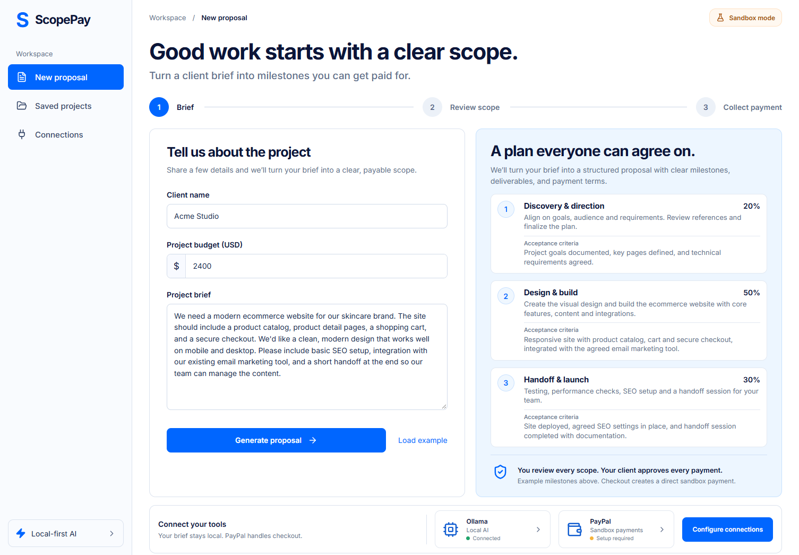

# Hosting on Appwrite

The free cloud deployment uses Appwrite Sites, Functions, private TablesDB storage and Groq AI. Follow [the deployment guide](docs/APPWRITE.md). Local Ollama remains available. Hosted website: https://scopepay-6ac67660.appwrite.network. Appwrite hosting and authenticated backend requests are verified. Real Groq generation, scope approval and saved-project persistence are verified live. PayPal sandbox credentials are still needed for checkout.

# ScopePay

**A clear scope. A better way to get paid.**

ScopePay helps freelancers turn a vague client brief into an editable proposal with three milestones and testable acceptance criteria. Ollama processes the brief locally. Once the freelancer reviews and approves the scope, a sandbox buyer accepts a milestone and pays through PayPal. ScopePay verifies and captures the payment on the server, then records the receipt against that milestone.

Built for the PayPal AI Hackathon. The hosted app uses real Groq AI; local mode supports Ollama. PayPal sandbox code is implemented, but real payment verification still needs sandbox credentials. No simulated AI output or fake paid state is substituted.



## Run locally

Requirements: Node.js 20.19+ (or 22.12+), npm, Ollama, roughly 500 MB free for the default model in addition to the Ollama installation, and a PayPal sandbox app for payments. The small default model suits limited-memory machines. Quality and speed depend on available RAM and hardware; close unnecessary applications if loading is slow.

```powershell
npm install
```

Install [Ollama](https://ollama.com/download), open it and download the model:

```powershell
ollama pull qwen2.5:0.5b
```

On Windows, this project also provides `npm run setup:ollama`, which installs Ollama through winget if missing, starts its local server, and pulls the model. The installation/model download requires internet; subsequent AI generation runs locally. If Ollama isn't running, use `ollama serve`.

```powershell
Copy-Item .env.example .env.local
```

Create an app under **Apps & Credentials → Sandbox** in the [PayPal Developer Dashboard](https://developer.paypal.com/dashboard/applications/sandbox). Put its sandbox client ID and secret in `.env.local`. Never commit this file. An AI API key is not needed.

```dotenv
OLLAMA_BASE_URL=http://127.0.0.1:11434
OLLAMA_MODEL=qwen2.5:0.5b
PAYPAL_CLIENT_ID=your-sandbox-client-id
PAYPAL_CLIENT_SECRET=your-sandbox-client-secret
```

```powershell
npm run dev
```

Open **http://127.0.0.1:5173**. The API runs on port 3001. Connection status checks Ollama availability/model presence and whether PayPal credentials are configured; PayPal validates credentials at checkout. Restart the API after changing credentials or model configuration. Brief generation works independently of PayPal credentials.

## Demo the complete flow

1. Start with the example brief or enter another brief of at least 30 characters, a client name and a USD budget from $10–$100,000.
2. Click **Generate proposal**. The real local model returns a structured scope; the first request may take several minutes. Failed generation shows an error and never substitutes a canned proposal.
3. Review and edit the title, summary, deliverables, acceptance criteria, assumptions and exclusions. The default 20% / 50% / 30% allocation is a deterministic payment plan, not an AI price estimate. Percentages must total 100.
4. Confirm review and **Approve scope**. This locks the proposal and fixes all payment amounts on the server.
5. In **Buyer checkout**, choose a milestone, accept its criteria and click **Pay with PayPal**. This local demo lets you act as freelancer and buyer on the same machine; it does not provide a public client portal.
6. Log in to PayPal using a **sandbox personal buyer account**, different from the merchant account associated with the sandbox app. Test accounts are under **Testing Tools → Sandbox Accounts**. Do not use your real PayPal login for a sandbox buyer.
7. Approve checkout. PayPal returns to ScopePay. Click **Complete sandbox payment**; ScopePay checks the stored order, verifies the amount/currency/project reference, captures it, and records the completed receipt.
8. Reopen **Saved projects** or export the proposal as Markdown. Data is persisted in ignored `data/projects.json`.

Cancellation never marks a milestone paid. If a capture succeeds but the browser loses the response, reopen the project and click **Check payment status** to reconcile it. Order creation and capture have persistent idempotency keys; concurrent requests for a milestone are serialized.

## Tools and integrations

| Tool | Meaningful use |
| --- | --- |
| Groq + GPT-OSS 20B | Generates schema-constrained proposals for hosted users using a server-side key. |
| Appwrite Sites, Functions, Auth and TablesDB | Hosts the website/API, authenticates browser workspaces and persists private projects and payment locks. |
| Ollama + Qwen 2.5 0.5B | Generates client-specific scope, deliverables, acceptance criteria, assumptions and exclusions through `/api/chat` with JSON-schema constrained output. No cloud AI service or subscription. |
| PayPal Orders v2 + OAuth | Creates milestone orders, redirects the sandbox buyer for approval, verifies server-side order details, captures payments and stores capture receipts. All requests target `api-m.sandbox.paypal.com`. |
| React + Vite | Responsive brief, review, payment and saved-project screens. |
| Express + Zod | Validates inputs/model output, enforces approval and payment state transitions, calculates amounts in integer cents. |
| Node filesystem | Stores local proposals, order references and receipts across server restarts. |

AI never creates a payment or approves its own output. PayPal is central to the product: approved scope becomes an actual sequence of buyer-approved sandbox payments, each tied to acceptance criteria and a verified capture.

Model weights are downloaded separately; [Qwen 2.5 0.5B](https://ollama.com/library/qwen2.5:0.5b) is Apache 2.0 licensed. ScopePay code is MIT licensed; model weights and third-party dependencies retain their own licenses. For better output on a machine with more free RAM, pull `qwen2.5:1.5b` (or a larger instruction model) and set `OLLAMA_MODEL` accordingly. This workspace and clean installs default to the smaller 0.5B model. Small models can produce repetitive, incorrect or incomplete criteria; always review and correct the generated content.

## Checks and build

```powershell
npm test
npm run build
```

Tests cover money rounding, validation, approval gating, buyer acceptance, wrong-order/amount rejection, concurrency, repeated capture, AI errors and provider request wiring. PayPal tests use a test double; they do not replace a real sandbox transaction.

See [verification notes](docs/VERIFICATION.md) for browser checks, design comparisons and the small-model limitations observed during actual generation.

To serve the built app from the API instead of Vite, set `APP_URL=http://127.0.0.1:3001` in `.env.local`, run `npm run build`, then `npm start`, and open that URL. Use the same browser origin throughout checkout.

## API

| Method | Route | Purpose |
| --- | --- | --- |
| GET | `/api/status` | Model readiness and sandbox configuration |
| GET | `/api/projects` | Saved local projects |
| GET | `/api/projects/:id` | Restore a project |
| POST | `/api/proposals` | Generate and persist an AI proposal |
| POST | `/api/projects/:id/approve` | Validate edits and lock scope |
| POST | `/api/projects/:id/milestones/:index/order` | Create/reuse a PayPal sandbox order |
| POST | `/api/projects/:id/milestones/:index/capture` | Verify and capture or reconcile payment |

## Prototype boundaries

The local Express server binds to loopback and rejects other hosts/origins; use the Appwrite adapter for hosting. Hosted workspaces use anonymous authenticated browser sessions with private storage, but have no recovery or cross-device login. Further production work requires separate freelancer/buyer roles, verified webhooks, privacy controls and deployment hardening. This is direct milestone collection, not escrow, lending or automated fund release. It supports USD and three milestones per proposal.

## Hackathon submission

This repository includes source, an MIT license and runnable instructions. See [submission copy](docs/SUBMISSION.md), [judge instructions](docs/JUDGING.md), [video plan](docs/VIDEO.md) and [checklist](docs/CHECKLIST.md). Before final submission, verify a real sandbox buyer payment, record/upload a public YouTube video under three minutes, and complete Devpost. Hosted demo: https://scopepay-6ac67660.appwrite.network. Public source: https://github.com/KARTHIKEYAN124/scopepay-paypal-ai. A hosted URL is optional when complete local setup instructions are provided.

References: [Ollama chat API](https://docs.ollama.com/api/chat), [Ollama Windows setup](https://docs.ollama.com/windows), [PayPal Orders v2](https://developer.paypal.com/api/orders/v2), [Hackathon requirements](https://paypalaihackathon.devpost.com/).
